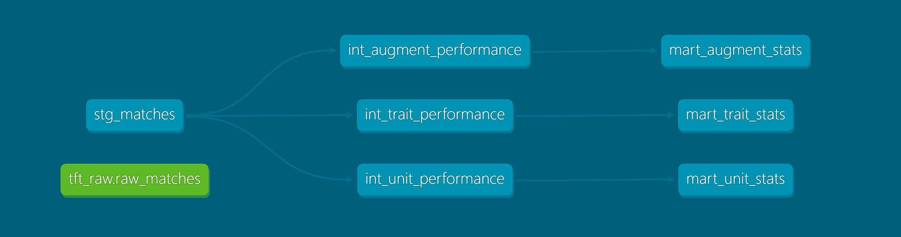
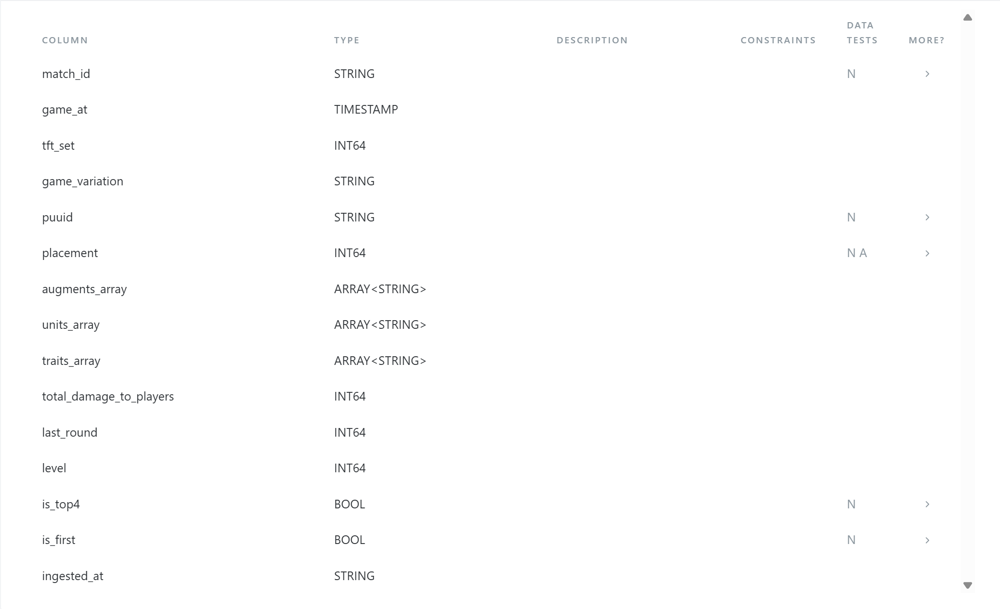

# TFT Meta Analytics Pipeline

An end-to-end data engineering pipeline that ingests Teamfight Tactics 
match data from the Riot Games API, transforms it through a dbt layer 
on Google BigQuery, applies statistical analysis and operations research 
optimisation, and serves results through an interactive Streamlit dashboard.

---

## Architecture

Riot Games API
↓
Python Ingestion (rate limiting, deduplication)
↓
Google BigQuery (raw layer)
↓
dbt Transformation (staging → intermediate → marts)
↓
Stats Layer (scipy, numpy)    OR Optimizer (PuLP)
↓
Streamlit Dashboard

---

## What Makes This Different From a Notebook Project

- Production pipeline with rate limiting, error handling, and logging
- dbt transformation layer with column-level tests and auto-generated 
  documentation
- Statistical rigour: z-score outlier detection, Kolmogorov-Smirnov 
  distribution fitting, OLS regression implemented from scratch using 
  NumPy matrix operations
- OR layer: binary linear program for composition optimisation under 
  contested-unit constraints with sensitivity analysis
- All layers connected end to end — raw API data flows through to 
  interactive dashboard without manual intervention

---

## Stack

| Layer | Technology |
|---|---|
| Ingestion | Python, Riot Games API |
| Storage | Google BigQuery (GCP) |
| Transformation | dbt |
| Statistics | Python, scipy, statsmodels, NumPy |
| Optimisation | PuLP (binary LP) |
| Dashboard | Streamlit, Plotly |
| Version control | Git, GitHub |

---

## Results

Data: 6,800+ participant rows from 850+ matches across 50 EUW 
challenger players (Set 16)

**Unit outlier detection (z-scores):**
- BaronNashor: z=+3.19 — strongest overperformer in current meta
- Sylas: z=+2.47 — statistically anomalous overperformer
- Qiyana: z=-3.41 — strongest underperformer, avoid in current meta

**Placement distribution fitting (KS test):**
- Normal distribution best fits avg placement data (p=0.29)
- Cannot reject null hypothesis of good fit at 5% significance level

**OLS Regression (avg_placement ~ top4_rate):**
- R² = 0.94 — top4 rate explains 94% of variance in average placement
- Coefficient = -5.47 — every 10% increase in top4 rate corresponds 
  to 0.55 lower placement number
- p-value = 0.0 — relationship is highly statistically significant
- Implemented manually using NumPy: β = (X'X)⁻¹X'y

**OR Composition Optimizer:**
- Binary LP formulation selecting optimal 7-unit board
- Contest penalty parameter penalises units likely to be taken by 
  other players
- Sensitivity analysis shows alternative compositions when key units 
  are unavailable

---

## dbt Model Lineage




**Models:**
- `stg_matches` — cleans and deduplicates raw match data
- `int_unit_performance` — aggregates placement stats per unit
- `int_trait_performance` — aggregates stats per trait-tier combination
- `int_augment_performance` — augment stats (empty in Set 16, 
  augments removed by Riot)
- `mart_unit_stats` — final unit table with rankings and Wilson CI
- `mart_trait_stats` — final trait table with tier rankings
- `mart_augment_stats` — final augment table (empty in Set 16)

---

## Project Structure

tft-meta-pipeline/
├── ingestion/
│   ├── riot_client.py      # API client with rate limiting
│   └── ingest.py           # ingestion + BigQuery loading
├── dbt_project/tft_meta/
│   └── models/
│       ├── staging/        # cleaning and deduplication
│       ├── intermediate/   # aggregation logic
│       └── marts/          # final analytical tables
├── analytics/
│   ├── stats_model.py      # z-scores, distribution fitting, OLS
│   └── or_optimizer.py     # binary LP composition optimizer
├── dashboard/
│   └── app.py              # Streamlit dashboard
└── requirements.txt

---

## How to Run

**1 — Clone and install dependencies**
```bash
git clone https://github.com/hsodi/tft-meta-pipeline.git
cd tft-meta-pipeline
python -m venv venv
venv\Scripts\activate
pip install -r requirements.txt
```

**2 — Set up credentials**

Create a `.env` file:

RIOT_API_KEY=your_key_from_developer.riotgames.com
GCP_PROJECT_ID=your_gcp_project_id

Authenticate with GCP:
```bash
gcloud auth application-default login
```

**3 — Run ingestion**
```bash
python -m ingestion.ingest
```

**4 — Run dbt transformations**
```bash
cd dbt_project/tft_meta
dbt run
dbt test
```

**5 — Run statistical analysis**
```bash
python -m analytics.stats_model
python -m analytics.or_optimizer
```

**6 — Launch dashboard**
```bash
streamlit run dashboard/app.py
```

---

## Limitations

- Set 16 removed augments from the API response — augment analysis 
  is not possible with current data
- ANOVA on trait tier performance requires more data per tier 
  (~20,000+ rows) for reliable results
- Development API key expires every 24 hours — production key 
  required for scheduled ingestion

